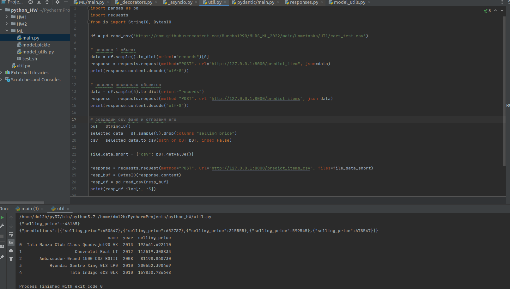
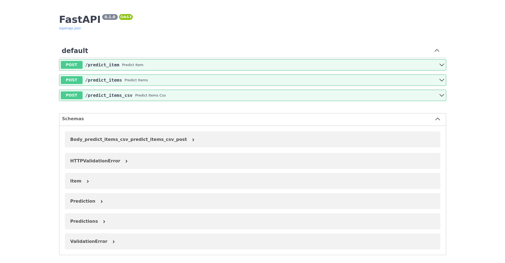

### Краткое описание структуры
В папке проета лежат 3 ожидаемых файла - main.py, model.pickle и ноутбук, но кроме этого включены еще два файла:

* model_utils.py, содержащий все необходимые функции из ноутбука, необоходимые для сборки модели и предобработки данных
* и test.py, которые демонстрирует работоспособность fastAPI

### Что было сделано

* Разделил Torque на две колонки, но итоговый рост предсказательной мощности был незначительным
* добавил квадратичные признаки для пробега и года (также несущественный прирост)
* добавил в признаки марку и модель машины, закодированные через target (существенный прирост в ~0.3 R2)

Target-кодирование осуществлялось как поправка к средней цене, сначала всех машин производителя, потом конкретной модели.
Таким образом, при обработке незнакомой марки или модели мы сохраняем возможность считать предсказание от наиболее точного из доступных средних.
Остальные фичи оказались не очень полезными в предсказании - все параметры двигателя как правило совпадали для одной  и и той же модели,
а хорошей зависимости между пробегом или количеством хозяев у машины не наблюдалось. Скорее всего, состояние и комплектация играли большую роль,
но они никак не отражены в данных.

Что не успел сделать:
* стоило убрать явные выбросы, обучившись на данных, отстооящих не больше на n стандартных отклонений от среднего по каждому признаку.
 В трейне очевидно были заметны объекты, которые являлись выбросами и могли влиять на точность предсказания.
* Скорее всего факторы пробега, числа владельцев и другие признаки оказывают не линейный, а мультипликатинвый эффект на цену.
Возможно стоило попробовать предсказывать цену, нормированную на среднюю цену модели, или, при недостатке наблюдений, хотя бы производителя.

### Визуализация сервиса

из-за того, что json и csv занимают много места, и в консоли смотреть на объекты не очень приятно, лучшим выходом показалось показать тестирующий код:

а вот автосгенерированная документация:
